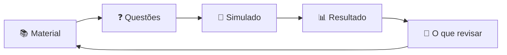

<div align="center">


<p>
  <a href="https://github.com/igor-fuchs01/student-app/actions/workflows/ci.yml"></a>
  
  <a href="LICENSE"></a>
</p>

**Uma plataforma web para estudantes se prepararem para provas:**
<br />
disciplinas, simulados, resultado comentado e um ranking que premia a constância, não a nota.

[🚀 Rodar agora](#-rodando-o-projeto) •
[✨ O que tem pronto](#-o-que-já-dá-para-fazer) •
[📖 Glossário](#-glossário) •
[🆘 Deu erro?](#-deu-erro) •
[🤝 Contribuir](#-quer-contribuir)

</div>

---

## 🤔 O que é o Student App?

Sabe quando você faz uma prova, recebe um "7" e não faz ideia do que errou? O Student App existe
para resolver isso. A ideia é que, depois de um simulado, a pergunta respondida não seja *"quanto
eu tirei?"*, e sim:

> ### *"O que eu aprendi e o que ainda preciso estudar?"*

Por isso o projeto gira em torno de um **ciclo de estudo**:



> [!NOTE]
> O projeto está na fase de **MVP** (a primeira versão, só com o essencial). Algumas partes do ciclo,
> como materiais e recomendações automáticas, ainda estão sendo construídas.

---

## ✨ O que já dá para fazer

| Tela | O que você encontra |
|---|---|
| 🔐 **Login** | Entrada com matrícula ou e-mail. Não existe cadastro: as contas são criadas pelo responsável. |
| 🏠 **Início** | A próxima prova, os assuntos que merecem mais atenção e um plano de estudo do dia. |
| 📘 **Disciplinas** | As matérias do curso, com quantidade de materiais, questões e o seu nível de preparo. |
| 📝 **Simulados** | Provas de treino com cronômetro (ou sem limite), 6 tipos de questão, marcação para revisar depois e revisão antes de enviar. |
| 📊 **Resultado** | Acertos, erros, desempenho por disciplina e a explicação de cada questão errada. |
| 🔥 **Ranking** | Quem estudou mais dias seguidos. **Nunca** mostra nota de ninguém. |

<details>
<summary><b>🧩 Quais são os 6 tipos de questão?</b></summary>
<br />

| Tipo | Como funciona |
|---|---|
| Múltipla escolha | Uma alternativa correta. |
| Múltiplas alternativas | Mais de uma alternativa correta. |
| Seleção única | Você completa um texto escolhendo opções em listas. |
| Arrastar e soltar | Você arrasta termos para os espaços certos do texto. |
| Dissertativa | Você escreve a resposta. |
| Dissertativa com lacunas | Você completa um texto digitando nas lacunas. |

</details>

---

## 🧰 Requisitos

Você só precisa de duas ferramentas instaladas no computador:

| Ferramenta | Para que serve | Download |
|---|---|---|
|  **Node.js** (versão 20.19+ ou 22.12+) | Roda o projeto no seu computador. Já vem com o **npm**, que baixa as bibliotecas que o projeto usa. | [nodejs.org](https://nodejs.org/) (pegue a versão **LTS**) |
|  **Git** | Baixa o código do GitHub e guarda o histórico de mudanças. | [git-scm.com](https://git-scm.com/) |

## 🚀 Rodando o projeto

### 1️⃣ Baixe o código

No terminal, vá até a pasta onde quer guardar o projeto e rode:

```bash
git clone https://github.com/igor-fuchs01/student-app.git
cd student-app
```

> O `git clone` faz uma cópia do projeto no seu computador. O `cd` entra na pasta que foi criada.

### 2️⃣ Instale as dependências

```bash
npm install
```

> Isso baixa todas as bibliotecas que o projeto usa (React, por exemplo) para a pasta
> `node_modules`. Pode demorar um pouquinho na primeira vez, e só precisa ser feito de novo quando
> alguém adicionar uma biblioteca nova.

### 3️⃣ Ligue o projeto

```bash
npm run mock
```

Quando aparecer um endereço no terminal, abra **http://localhost:5173** no navegador. 🎉

Para entrar, use a conta de teste:

<div align="center">

| 👤 Matrícula ou e-mail | 🔑 Senha |
|:---:|:---:|
| `senaiigorpereira` ou `igor@email.com` | `123456` |

</div>

Para desligar, volte ao terminal e aperte <kbd>Ctrl</kbd> + <kbd>C</kbd>.

<details>
<summary><b>🤖 Espera, o que é esse "mock"?</b></summary>
<br />

Um sistema como este normalmente tem duas partes:

- **Frontend**: a parte que você vê e clica (telas, botões). É o que existe neste repositório.
- **Backend**: um servidor que guarda os dados de verdade (alunos, questões, notas) e responde ao
  frontend.

O backend **ainda não existe**. Para o frontend funcionar mesmo assim, o comando `npm run mock` liga
um **servidor de mentira** que roda dentro do próprio navegador e responde com dados de exemplo.
"Mock" quer dizer justamente isso: uma imitação. Você usa o app normalmente, mas nada é salvo de
verdade: recarregou a página, algumas informações (como o número de tentativas) voltam ao início.

Quem faz essa imitação é a biblioteca **MSW** (Mock Service Worker). Ela fica "no meio do caminho"
entre o app e a internet: quando o app pede algo para a API, o MSW intercepta o pedido e responde
no lugar do backend. Quer ver acontecendo? Com o app aberto, aperte <kbd>F12</kbd>, vá na aba
**Rede** (*Network*) e navegue pelas telas: os pedidos que começam com `/api` são respondidos pelo
mock.

As respostas ficam em [`handlers.ts`](src/services/api/mocks/handlers.ts), os dados de exemplo na
mesma pasta [`src/services/api/mocks/`](src/services/api/mocks/), e a conta de teste em
[`users.ts`](src/services/api/mocks/users.ts).

</details>

<details>
<summary><b>🎫 E como o login funciona?</b></summary>
<br />

Quando você entra, o servidor (o mock, por enquanto) te entrega um **token JWT**. Pense nele como um
**crachá digital**: em cada tela que precisa de login, o app mostra esse crachá ao servidor para
provar que é você.

Esse crachá **vence em 3 dias**. Depois disso, o servidor não aceita mais, e você volta
automaticamente para a tela de login para pegar um novo.

Os detalhes técnicos estão em [`docs/04-contratos-de-api.md`](docs/04-contratos-de-api.md), seção 5.

</details>

---

## 📜 Comandos úteis

Todos rodam no terminal, dentro da pasta do projeto:

| Comando | O que faz | Quando usar |
|---|---|---|
| `npm run mock` | Liga o app com dados de exemplo. | **No dia a dia.** É o jeito mais fácil de ver o app funcionando. |
| `npm run dev` | Liga o app conectado a um backend de verdade. | Só quando existir um backend (veja [Deu erro?](#-deu-erro)). |
| `npm run build` | Gera a versão final e otimizada do site, na pasta `dist`. | Para conferir se está tudo compilando. |
| `npm run lint` | Procura erros e más práticas no código (ESLint). | Antes de enviar uma alteração. |
| `npm run format` | Arruma a formatação do código automaticamente (Prettier). | Antes de enviar uma alteração. |
| `npm run format:check` | Só verifica a formatação, sem mudar nada. | É o que a CI usa. |

---

## 🗂️ Como o projeto está organizado

```text
student-app/
├── src/                  → 💻 o código do app
│   ├── app/              →    rotas (qual tela abre em qual endereço)
│   ├── components/       →    peças visuais reutilizáveis (botões, cards, modais…)
│   ├── features/         →    cada funcionalidade em sua pasta
│   │   ├── auth/         →       login e logout
│   │   ├── dashboard/    →       tela de Início
│   │   ├── subjects/     →       Disciplinas
│   │   ├── quizzes/      →       Simulados e resultado
│   │   └── ranking/      →       Ranking
│   ├── services/         →    conversa com o servidor (API) e com o navegador (localStorage)
│   ├── styles/           →    cores, fontes e estilos gerais
│   └── types/            →    o "formato" dos dados que vêm da API
├── database/             → 🐘 scripts do banco de dados e Docker
└── docs/                 → 📖 documentação completa do produto
```

> 💡 **Dica para quem está começando:** comece lendo uma tela de ponta a ponta. Por exemplo, abra
> `src/features/ranking/` e siga o caminho: a tela → o `rankingApi` em `services/api/` → o formato
> dos dados em `types/ranking.ts` → os dados de exemplo em `services/api/mocks/ranking.ts`.

---

## 🛠️ Tecnologias

<div align="center">

[](https://skillicons.dev)

</div>

| Tecnologia | Para que serve aqui, em uma frase |
|---|---|
| **React** | Monta as telas em pedaços reutilizáveis, chamados componentes. |
| **TypeScript** | É o JavaScript com tipos: avisa de muitos erros antes mesmo de rodar o código. |
| **Vite** | Liga o projeto em modo de desenvolvimento e gera a versão final do site. |
| **styled-components** | Permite escrever o CSS de cada componente junto dele. |
| **React Router** | Decide qual tela aparece para cada endereço (`/simulados`, `/ranking`…). |
| **TanStack Query** | Busca os dados do servidor e guarda em cache para não pedir de novo à toa. |
| **Zustand** | Guarda informações que o app inteiro precisa, como "quem está logado". |
| **Zod** | Confere se os dados que chegaram do servidor têm o formato esperado. |
| **MSW** | Imita o backend dentro do navegador, para o app funcionar com dados de exemplo. |
| **PostgreSQL + Docker** | O banco de dados planejado para o backend, e um jeito fácil de ligá-lo no seu computador. |

---

## 🐘 Banco de dados (opcional)

> **Você não precisa disto para rodar o app.** O `npm run mock` já basta. Esta parte é para quem
> quer mexer com o banco de dados que o backend utiliza.

O banco foi modelado a partir do que o app precisa. A explicação completa, com diagramas, está em
[`docs/06-modelagem-de-dados.md`](docs/06-modelagem-de-dados.md), e os scripts ficam em
[`database/`](database/).

Com o [Docker](https://www.docker.com/products/docker-desktop/) instalado, um comando liga um
PostgreSQL já com as tabelas criadas e dados de exemplo:

```bash
docker compose -f database/docker-compose.yml up -d
```

<details>
<summary><b>🐳 O que é Docker, e como eu me conecto nesse banco?</b></summary>
<br />

O **Docker** roda programas dentro de "caixinhas" isoladas, chamadas **containers**. Assim você usa
um PostgreSQL sem precisar instalá-lo e configurá-lo à mão: o arquivo `docker-compose.yml` já diz
tudo o que a caixinha precisa.

Para se conectar com um programa como o [DBeaver](https://dbeaver.io/) ou o
[pgAdmin](https://www.pgadmin.org/), use:

| Campo | Valor |
|---|---|
| Host | `localhost` |
| Porta | `5432` |
| Banco | `student_app` |
| Usuário | `student_app` |
| Senha | `student_app` |

Para desligar: `docker compose -f database/docker-compose.yml down`.
<br />
Para desligar **e apagar os dados**: `docker compose -f database/docker-compose.yml down -v`.

</details>

---

## 🆘 Deu erro?

<details>
<summary><b>❌ "npm" ou "node" não é reconhecido como comando</b></summary>
<br />

O Node.js não está instalado, ou o terminal foi aberto antes da instalação. Instale pelo
[nodejs.org](https://nodejs.org/), **feche e abra o terminal de novo** e tente outra vez.

</details>

<details>
<summary><b>❌ Rodei <code>npm run dev</code> e a página ficou em branco</b></summary>
<br />

O `npm run dev` tenta falar com um backend de verdade, e ele ainda não existe. Use
**`npm run mock`**.

Se você tiver um backend, copie o arquivo de exemplo de configuração e coloque nele o endereço da
sua API:

```bash
cp .env.development.example .env.development
```

</details>

<details>
<summary><b>❌ "Port 5173 is already in use"</b></summary>
<br />

Já tem outro projeto usando essa porta, provavelmente o próprio Student App aberto em outro
terminal. Feche o outro terminal (ou aperte <kbd>Ctrl</kbd> + <kbd>C</kbd> nele) e rode de novo.

</details>

<details>
<summary><b>❌ Erro na instalação ou versão do Node muito antiga</b></summary>
<br />

Confira a versão com `node -v`. O projeto precisa da **20.19+** ou da **22.12+**. Se a sua for mais
antiga, instale a versão LTS do [nodejs.org](https://nodejs.org/), apague a pasta `node_modules` e
rode `npm install` de novo.

</details>

<details>
<summary><b>❌ Fui mandado de volta para a tela de login</b></summary>
<br />

É normal: o seu "crachá" (token) venceu, depois de 3 dias. Basta entrar de novo com a conta de
teste.

</details>

---

## 📖 Glossário

<details>
<summary><b>Clique para ver as palavras que aparecem por aqui</b></summary>
<br />

| Palavra | Em português claro |
|---|---|
| **Clonar** | Baixar uma cópia do repositório para o seu computador. |
| **Dependência** | Uma biblioteca feita por outras pessoas que o projeto usa. |
| **API** | O "cardápio" de pedidos que o frontend pode fazer ao backend. |
| **Mock** | Uma imitação: aqui, um servidor falso com dados de exemplo. |
| **Token / JWT** | Um crachá digital que prova quem você é depois do login. |
| **Build** | A versão final e otimizada do site, pronta para publicar. |
| **Lint** | Uma revisão automática do código atrás de erros comuns. |
| **CI** | Um robô que testa o código sempre que alguém envia mudanças. |
| **MVP** | A primeira versão do produto, só com o essencial. |
| **Docker / container** | Uma caixinha isolada que roda um programa já configurado. |
| **localhost** | O endereço do seu próprio computador. |

</details>

---

## 🤝 Quer contribuir?

Toda ajuda é bem-vinda, inclusive de quem está começando agora!

- 🧭 **Guia passo a passo:** [`docs/CONTRIBUTING.md`](docs/CONTRIBUTING.md)
- 📚 **Documentação do produto:** [`docs/README.md`](docs/README.md) (regras de negócio, arquitetura,
  contratos de API e modelagem de dados)
- 🌱 **Ideias para o futuro:** [`docs/05-melhorias-futuras.md`](docs/05-melhorias-futuras.md)

---

<div align="center">


</div>
