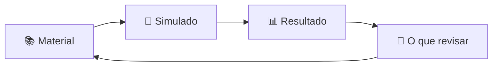

<div align="center">


**Estude para as provas sabendo exatamente o que revisar.**

[](https://github.com/igor-fuchs01/student-app/actions/workflows/ci.yml)
[](LICENSE)

</div>

## 🤔 A ideia

Tirar "7" numa prova não diz o que você errou. No Student App, depois de cada simulado, a pergunta
não é *"quanto eu tirei?"*, e sim ***"o que ainda preciso estudar?"***



## ✨ O que dá para fazer

- 📘 **Disciplinas** com o seu nível de preparo em cada uma.
- 📝 **Simulados** com cronômetro e 6 tipos de questão.
- 📊 **Resultado comentado**, com a explicação de cada erro.
- 🔥 **Ranking de constância**: premia quem estuda todo dia, nunca mostra notas.

> [!NOTE]
> O projeto está no **MVP** (primeira versão, só com o essencial).

## 🚀 Como rodar

Precisa ter instalado o [Node.js](https://nodejs.org/) (LTS) e o [Git](https://git-scm.com/).

```bash
git clone https://github.com/igor-fuchs01/student-app.git
cd student-app
npm install
npm run mock
```

Abra **http://localhost:5173** e entre com `igor@email.com` / `123456`.

> O `npm run mock` usa dados de exemplo, então não precisa de backend nem banco de dados.

## 📖 Quer saber mais?

| | |
|---|---|
| 🧭 [Primeiros passos](docs/PRIMEIROS-PASSOS.md) | Comandos, pastas, tecnologias, banco de dados, erros comuns e glossário. |
| 🤝 [Como contribuir](docs/CONTRIBUTING.md) | Do fork ao Pull Request, passo a passo. |
| 📚 [Documentação do produto](docs/README.md) | Regras de negócio, arquitetura e contratos de API. |

<div align="center">


</div>
